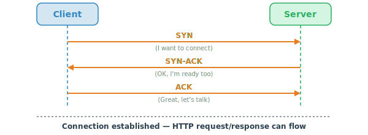

# Transmission Control Protocol (TCP)
Delivers data in a reliable and ordered manner.

Before any HTTP data flows, a **three-way handshake** establishes a connection.

Source: [CSE 135 - Thomas Powell](https://cse135.site/foundations-overview.html)